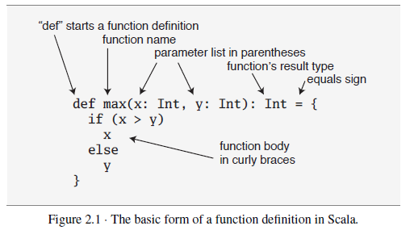
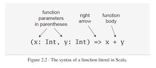

# Chapter 2 - 스칼라 첫걸음 

## 설치
```
brew install scala
```

## 2-1 스칼라 인터프리터 사용법을 익히자
```
scala

scala> 1+2
val res0: Int = 3
```

* 스칼라는 모든것이 클래스다

```
scala> res0 * 3
val res1: Int = 9

scala> println("Hello, world!")
Hello, world!
```

* System.out.println 과 비슷

## 2-2 변수 정의
* val(value - immutable), var(variable - mutable)

* 타입추론됨
```
scala> val msg = "Hello, world"
val msg: String = Hello, world
```

* 타입 명시
```
scala> val msg2: java.lang.String = "Hello again, world!"
val msg2: String = Hello again, world!
```

## 2-3 함수 정의
```
scala> def max(x: Int, y: Int): Int = {
     |   if (x > y) x else y
     | }
def max(x: Int, y: Int): Int
```



* 함수 써보기
```
scala> max(3, 5)
val res3: Int = 5
```

* Unit 
```
scala> def greet() = println("Hello, world!")
def greet(): Unit
```

* quit
```
scala> :quit
```

## 2-4 스칼라 스크립트 

* 심플
```
println("Hello, world, from a script!")
```
```
➜  chap_02 git:(master) ✗ scala hello.scala
Hello, world, from a script!
```

* args
```
// 첫 번째 인자에게 인사한다.
println("Hello, " + args(0) + "!")
```
```
➜  chap_02 git:(master) ✗ scala helloarg.scala planet
Hello, planet!
```

## 2-5 while 로 loop 를 돌고, if 로 결정해보자

* print simple
```scala
var i = 0
while (i < args.length) {
  println(args(i))
  i += 1
}
```
```
➜  chap_02 git:(master) ✗ scala printargs.scala Scala is fun
Scala
is
fun
```

* echo
```scala
var i = 0
while (i < args.length) {
  if (i != 0) {
    print(" ")
  }
  print(args(i))
  i += 1
}
println()
```
```
➜  chap_02 git:(master) ✗ scala echoargs.scala Scala is even more fun
Scala is even more fun
```

## 2-6 foreach 와 for 

* 함수형
```scala
args.foreach(arg => println(arg))
args.foreach((arg: String) => println(arg))
args.foreach(println) // 인자가 하나면
```
```
➜  chap_02 git:(master) ✗ scala pa.scala Concise is nice
Concise
is
nice
```

* function literal



* for
* arg 는 val
```
for (arg <- args)
  println(arg)
```
```
➜  chap_02 git:(master) ✗ scala forargs.scala for arg in args
for
arg
in
args
```

* 7장에서 자세히 설명함. 